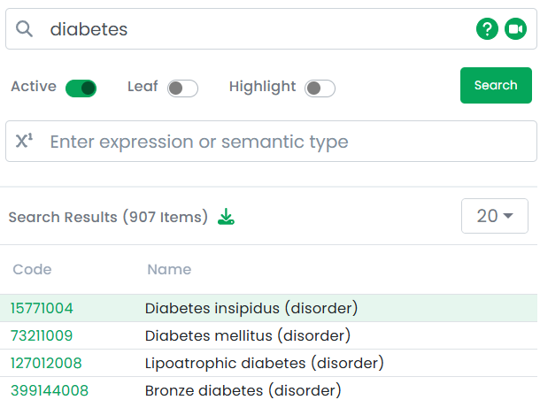
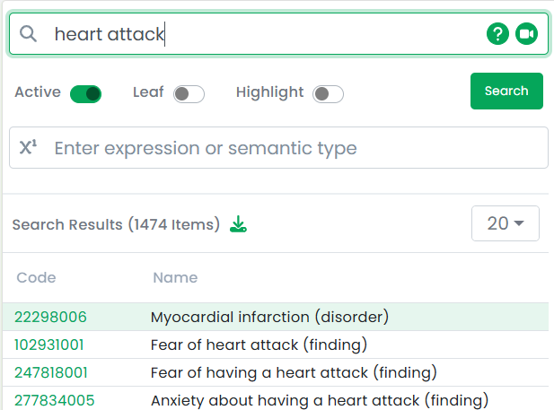
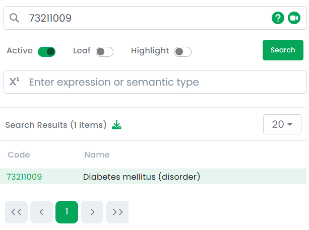
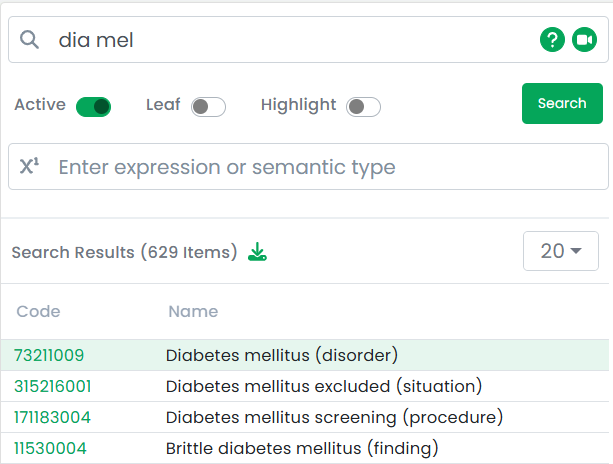

TermHub Help for the Browser Search Field
=========================================

## Overview

The "browser" page of each TermHub project has a search field used to perform searches within the specified terminologies.

This help page goes through a few scenarios to show the kinds of things you can enter into the search field and what you should expect to get back. All examples are shown in the "SNOMEDCT_US Latest" public project (https://demo.terminologyhub.com/projects/snomedct_us/browser) which is available to all TermHub users.

Follow along, or [watch a video presentation of these steps here](https://youtu.be/GPr7O2KaV9Q).

## Scenario #1 - Simple term search

For this first case, search a simple single term "diabetes". 

This performs a more complicated search in the background attempting to find all relevant matches while scoring results so that the closest, most likely thing desired is near the top.

This same search can be used with more than just a single word as well.

In this case, the search will actually find all matches containing either search term, but will rank those containing both search terms higher up in the results.  In this case the top result is actually called "Myocardial infarction", but a review of the content shows an exact match on a synonym to "heart attack".

## Scenario #2 - Searching by code

Alternatively, instead of searching to match on the names of concepts, TermHub supports searching directly for a code value by simply entering the code.

In this case, the search results include the only match which is the concept with exactly this code.  Some terminologies have codes with multiple parts (such as E11.0 in ICD10CM or 9088-6 in LOINC).  In these instances, matches will be returned matching any part of the entered code, but the concept matching exactly that code will be the first search result.

The search is designed to be "fruitful" and make sure it finds what a user is looking for and not trying to be overly restrictive, relying on ranking to ensure most likely results are at the top.

## Scenario #3 - Searching by word fragments

The search field also supports entering a single or multiple word fragments and completions of those words will be matched.

Here we are targeting a result of "diabetes mellitus", which indeed is found.  As with other searches, any matches to either of these word fragements will be returned, but matches to both words or fragments will float to the top of the search results.

**[Back to top](#overview)**

